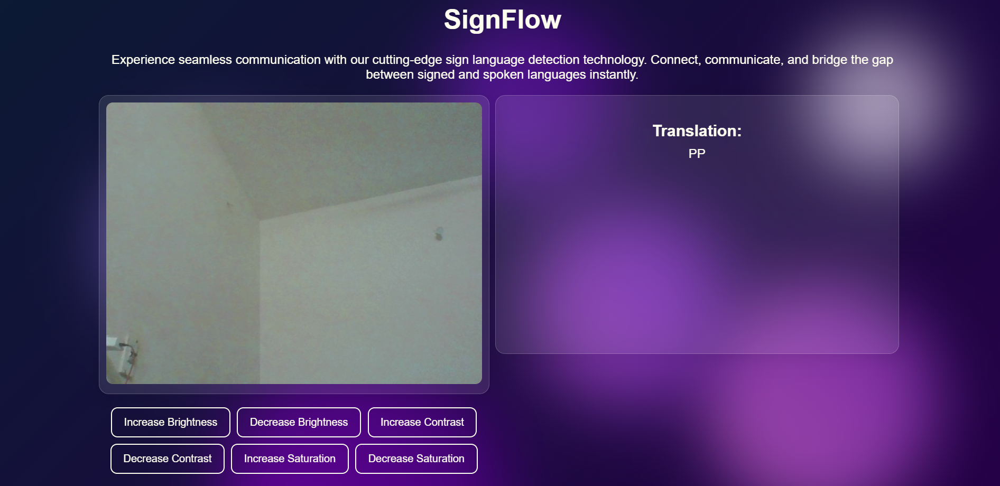
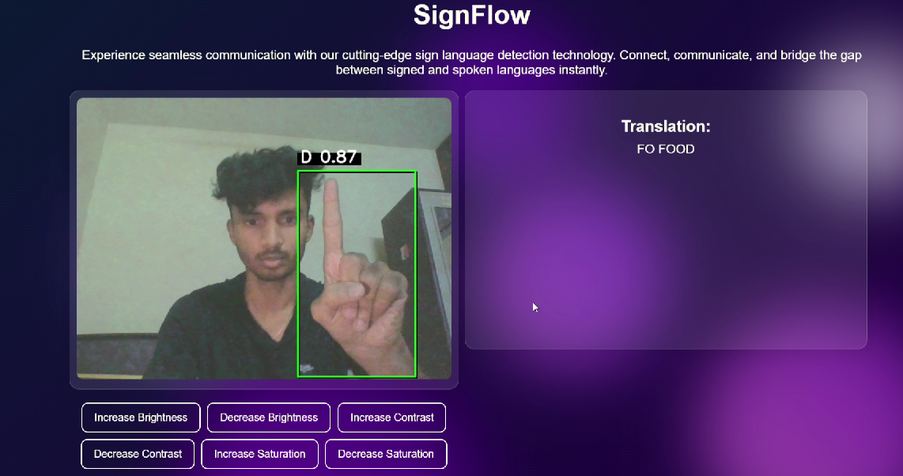

# SignFlow: Real-Time Sign Language Translation System


## Overview

SignFlow is a cutting-edge real-time sign language detection and translation system that bridges the communication gap between signed and spoken languages. Utilizing a fine-tuned YOLOv11 model with 93% accuracy, SignFlow detects hand signs from a live webcam feed and translates them into text instantaneously.

## Demo

### Application Interface


### Sign Language Detection in Action


## Features

- **Real-time Detection**: Processes webcam feed in real-time for immediate sign language detection
- **High Accuracy**: Built on a fine-tuned YOLOv11 model with 93% accuracy
- **Modern Interface**: Beautiful UI with glassmorphism design and animated backgrounds
- **Customizable Image Settings**: Adjustable brightness, contrast, and saturation for optimal detection in various lighting conditions
- **WebSocket Communication**: Fast and reliable communication between frontend and backend
- **Smooth Sign Translation**: Intelligently handles time-based sign detection with cooldown periods to reduce repetition

## Technical Stack

- **Backend**: FastAPI (Python)
- **Computer Vision**: OpenCV, Ultralytics YOLO
- **Frontend**: HTML5, CSS3, JavaScript
- **Communication**: WebSockets

## Project Structure

```
SignFlow/
├── app/
│   ├── main.py              # FastAPI application and WebSocket endpoint
│   ├── utils.py             # Utility functions for image processing and sign detection
│   └── templates/
│       └── index.html       # Frontend interface
├── best.pt              # Fine-tuned YOLOv11 model
├── assets/                  # Project images and screenshots
│   ├── signflow_interface.png
│   └── signflow_detection.png
└── requirements.txt
```

## Installation

1. Clone the repository:
   ```bash
   git clone https://github.com/Edric2412/Realtime-Sign-Language-Detection-and-Translation-using-YOLO.git
   cd Realtime-Sign-Language-Detection-and-Translation-using-YOLO
   ```

2. Create a virtual environment and activate it:
   ```bash
   python -m venv venv
   source venv/bin/activate  # On Windows: venv\Scripts\activate
   ```

3. Install the required packages:
   ```bash
   pip install -r requirements.txt
   ```

4. Download the pre-trained model file:
   - Place the `best.pt` model file in the project root directory or update the model path in `utils.py`

## Usage

1. Start the FastAPI server:
   ```bash
   uvicorn app.main:app --reload
   ```

2. Open your browser and navigate to:
   ```
   http://127.0.0.1:8000
   ```

3. Grant camera access when prompted
4. Use sign language gestures in front of your webcam
5. View the real-time translations on the right side of the interface
6. Adjust image settings as needed for your environment using the control buttons

## Model Details

SignFlow uses a fine-tuned YOLOv11 model trained on a comprehensive dataset of sign language gestures. The model achieves 93% accuracy in various lighting conditions and can detect the following:

- American Sign Language (ASL) alphabet (A-Z)
- Common ASL phrases and words

As shown in the detection example above, the model identifies hand signs with high confidence (the detection shown has 0.87 confidence for sign "D") and translates sequences of signs into words or phrases like "FOOD".

## Customization

You can adjust detection parameters by modifying the following constants in `utils.py`:

- `no_sign_threshold`: Time threshold for recognizing when no sign is present
- `flash_duration`: Duration of the visual feedback flash
- `cooldown_duration`: Cooldown period between recognizing the same sign twice

## Contributing

Contributions are welcome! Please feel free to submit a Pull Request.

1. Fork the repository
2. Create your feature branch (`git checkout -b feature/amazing-feature`)
3. Commit your changes (`git commit -m 'Add some amazing feature'`)
4. Push to the branch (`git push origin feature/amazing-feature`)
5. Open a Pull Request

## Future Improvements

- Add support for continuous sign language (not just individual signs)
- Implement phrase prediction using NLP
- Add support for different sign languages (BSL, Auslan, etc.)
- Mobile application development
- Edge deployment for offline use

## License

This project is licensed under the MIT License - see the LICENSE file for details.

## Acknowledgments

- Ultralytics for the YOLO framework
- FastAPI team for the amazing web framework
- OpenCV contributors
